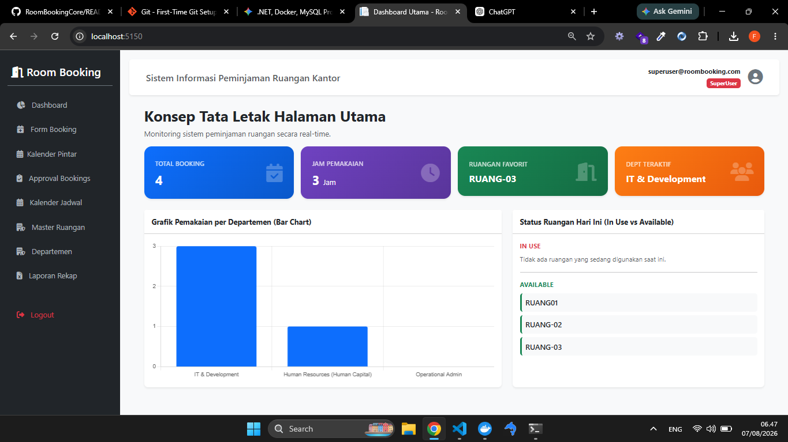

## 📸 Preview




# 🏢 Room Booking System

Note Aplikasi ini didevelop berbasis **ASP.NET Core Razor Pages** tetapi juga dilengkapi dengan **REST API** apabila kedepanya akan dihubungkan ke frontend app seperti React Js,Vuejs,Etc

---

## ✨ Fitur

- 📋 Manajemen data ruangan
- 📝 Pengajuan peminjaman ruangan
- ✅ Approval / Rejection booking
- 📊 Dashboard statistik
- 📅 Calendar View
- 📄 Export laporan (Excel)
- 🔗 REST API

---

# 🚀 Cara Menjalankan Project

## Persyaratan

Pastikan telah menginstall:

- .NET 8 SDK (atau versi terbaru)
- MySQL Server

## Konfigurasi Database

Sesuaikan **Connection String** pada file:

```json
appsettings.json
```

Contoh:

```json
"ConnectionStrings": {
  "DefaultConnection": "server=localhost;database=RoomBooking;user=root;password=yourpassword;"
}
```

## Jalankan Migrasi Database

Jika menggunakan Entity Framework Migration:

```bash
dotnet ef database update
```

## Menjalankan Aplikasi

```bash
dotnet run
```

Aplikasi akan berjalan pada:

```
https://localhost:xxxx
```

REST API:

```
http://localhost:5150/api/v1
```

---

# 🔌 REST API Documentation

## Base URL

```
http://localhost:5150/api/v1
```

---

## 1. Get All Rooms

### Endpoint

```http
GET /rooms
```

### Description

Mengambil seluruh daftar ruangan.

### Response

```json
[
  {
    "id": 1,
    "name": "Ruang Meeting A",
    "capacity": 10,
    "location": "Lantai 2"
  }
]
```

---

## 2. Dashboard Summary

### Endpoint

```http
GET /dashboard/summary
```

### Description

Menampilkan ringkasan statistik dashboard.

### Response

```json
{
  "totalRooms": 5,
  "totalBookings": 12,
  "pending": 2,
  "approved": 9,
  "rejected": 1
}
```

---

## 3. Create Booking

### Endpoint

```http
POST /bookings
```

### Headers

```text
Content-Type: application/json
```

### Request Body

```json
{
  "roomId": 1,
  "userId": 1,
  "departmentId": 1,
  "title": "Rapat Koordinasi Proyek",
  "startTime": "2026-08-10T09:00:00",
  "endTime": "2026-08-10T11:00:00"
}
```

### Response

```json
{
  "message": "Peminjaman berhasil diajukan.",
  "bookingId": 15
}
```

---

## 4. Update Booking Status

### Endpoint

```http
PUT /bookings/{id}/status
```

### Headers

```text
Content-Type: application/json
```

### Approve Request

```json
{
  "status": "Approved",
  "rejectionReason": null
}
```

### Reject Request

```json
{
  "status": "Rejected",
  "rejectionReason": "Ruangan sedang digunakan untuk acara kedinasan."
}
```

### Response

```json
{
  "message": "Status peminjaman berhasil diperbarui."
}
```

---

## 5. Calendar Events

### Endpoint

```http
GET /bookings/calendar
```

### Description

Mengambil seluruh booking yang telah disetujui untuk ditampilkan pada kalender.

### Response

```json
[
  {
    "id": 12,
    "title": "Rapat Koordinasi Proyek",
    "start": "2026-08-10T09:00:00",
    "end": "2026-08-10T11:00:00",
    "roomName": "Ruang Meeting A"
  }
]
```

---

## 6. Export Excel

### Endpoint

```http
GET /reports/export/excel
```

### Description

Mengunduh laporan peminjaman dalam format **Excel (.xlsx)**.

### Response

```
File (.xlsx)
```

---

# 🛠️ Tech Stack

| Technology | Description |
|------------|-------------|
| Framework | ASP.NET Core 8 |
| UI | Razor Pages |
| CSS | Bootstrap 5 |
| API | ASP.NET Core Web API |
| ORM | Entity Framework Core |
| Database | MySQL |
| Provider | Pomelo Entity Framework Core MySQL |
| Reporting | QuestPDF |

---

# 📁 Struktur Project

```
RoomBookingSystem
│
├── Controllers
├── Pages
├── Models
├── Data
├── Services
├── DTOs
├── wwwroot
├── appsettings.json
└── Program.cs
```

---

# 📌 API Summary

| Method | Endpoint | Description |
|---------|----------|-------------|
| GET | `/rooms` | Daftar ruangan |
| GET | `/dashboard/summary` | Statistik dashboard |
| POST | `/bookings` | Pengajuan booking |
| PUT | `/bookings/{id}/status` | Approve / Reject booking |
| GET | `/bookings/calendar` | Data kalender |
| GET | `/reports/export/excel` | Export laporan Excel |

---

# 👨‍💻 Tech Test

Project ini dibuat sebagai **Technical Test** menggunakan:

- ASP.NET Core 8
- Razor Pages
- Entity Framework Core
- MySQL
- REST API
- Bootstrap
- QuestPDF

---

## 📄 License

Project ini dibuat untuk keperluan **Technical Assessment / Portfolio**.
